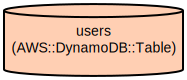

# NBA Newsletter Service: Personalized Game Updates and Player Stats

The NBA Newsletter Service is a FastAPI-based application that delivers customized NBA game updates and player statistics through email newsletters. The service allows users to track their favorite teams and players, providing real-time game results and performance statistics.

The application integrates with the NBA API to fetch live game data and player statistics, storing user preferences in AWS DynamoDB. Users can subscribe to newsletters, manage their team preferences, and receive personalized game updates. The service provides comprehensive coverage of NBA games, including scores, player statistics, and team performance metrics, all delivered through a clean HTML newsletter format.

## Repository Structure
```
.
├── app/                      # Main application directory
│   ├── api/                  # API route handlers for different endpoints
│   │   ├── games.py          # Endpoints for game-related operations
│   │   ├── newsletters.py    # Newsletter preview and delivery endpoints
│   │   ├── players.py        # Player statistics and search endpoints
│   │   ├── teams.py          # Team information endpoints
│   │   └── users.py          # User subscription management endpoints
│   ├── core/                 # Core application components
│   │   ├── config.py         # Application configuration settings
│   │   ├── dynamodb.py       # AWS DynamoDB connection handler
│   │   └── templates.py      # Jinja2 template configuration
│   ├── models/               # Data models and schemas
│   │   ├── stat.py           # Game statistics model
│   │   └── user.py           # User data model
│   ├── services/             # Business logic implementation
│   │   ├── games.py          # Game data retrieval service
│   │   ├── newsletter.py     # Newsletter generation service
│   │   ├── players.py        # Player statistics service
│   │   └── teams.py          # Team information service
│   └── templates/            # HTML templates
│       └── newsletter.html   # Newsletter template
├── tests/                    # Test suite directory
└── build-venv-*.sh           # Virtual environment setup scripts
```

## Usage Instructions
### Prerequisites
- Python 3.10 or higher
- AWS account with DynamoDB access
- NBA API access credentials
- pip package manager

Required environment variables:
```
AWS_REGION=<your-aws-region>
USERS_TABLE_NAME=<your-dynamodb-table>
BALLDONTLIE_API_KEY=<your-api-key>
```

### Installation

1. Clone the repository:
```bash
git clone <repository-url>
cd nba-newsletter
```

2. Set up virtual environment (choose based on your OS):

**MacOS**:
```bash
./build-venv-mac.sh
source venv_mac/bin/activate
```

**Linux**:
```bash
./build-venv-linux.sh
source venv_linux/bin/activate
```

**Windows**:
```bash
.\build-venv-win.bat
.\venv_win\Scripts\activate
```

3. Install dependencies:
```bash
pip install -r requirements.txt
```

### Quick Start
1. Start the FastAPI server:
```bash
uvicorn app.main:app --reload
```

2. Register a user:
```bash
curl -X POST "http://localhost:8000/api/users" \
     -H "Content-Type: application/json" \
     -d '{"email": "user@example.com"}'
```

3. Add favorite teams:
```bash
curl -X PUT "http://localhost:8000/api/users/teams" \
     -H "Content-Type: application/json" \
     -d '{"email": "user@example.com", "teams": ["Lakers", "Warriors"]}'
```

### More Detailed Examples

1. Get today's games:
```bash
curl "http://localhost:8000/api/games/today"
```

2. Search for players:
```bash
curl "http://localhost:8000/api/players/search?name=Stephen%20Curry"
```

3. Preview newsletter:
```bash
curl "http://localhost:8000/api/newsletters/preview"
```

## Data Flow
The application processes NBA game data and user preferences to generate personalized newsletters.

```ascii
[NBA API] --> [Game Service] --> [Newsletter Service]
     |              |                    |
     v              v                    v
[Player Stats] --> [Data Processing] --> [Template Engine]
     |                                   |
     v                                   v
[DynamoDB] <---- [User Preferences] --> [HTML Newsletter]
```

Component interactions:
- NBA API provides real-time game data and statistics
- Game Service processes and filters relevant game information
- User preferences are stored in DynamoDB
- Newsletter Service combines game data with user preferences
- Template Engine generates personalized HTML newsletters
- DynamoDB maintains user subscriptions and team preferences

## Infrastructure


### DynamoDB Resources
- Table: users
  - Primary Key: email (String)
  - Billing Mode: PAY_PER_REQUEST
  - Region: ap-northeast-2
  - No provisioned throughput (on-demand capacity)
  - Deletion protection: disabled