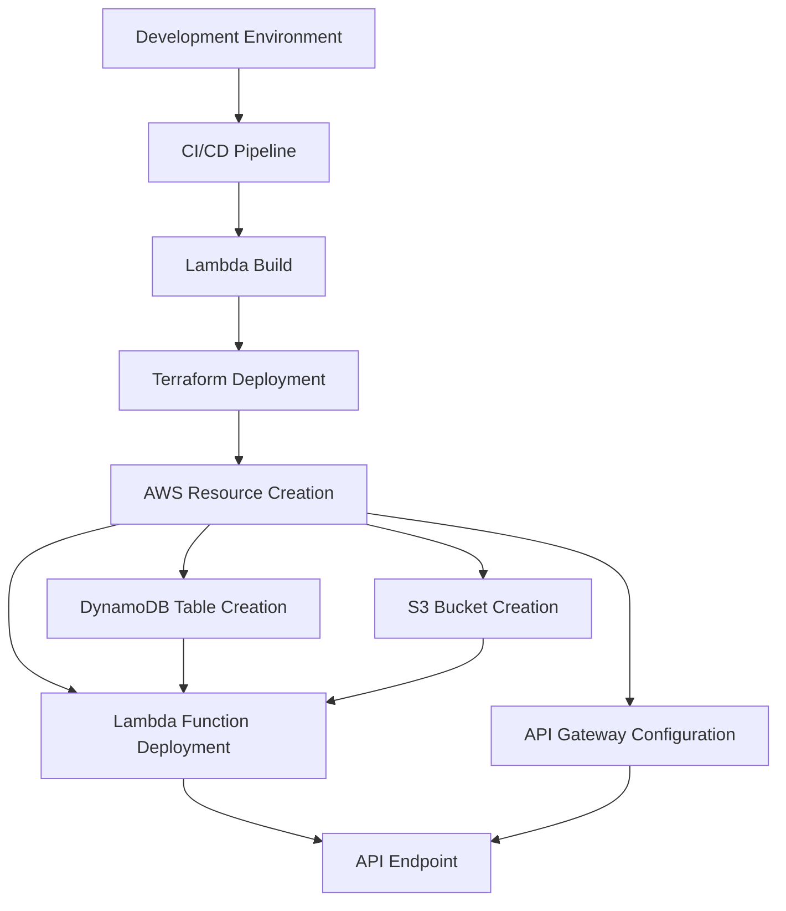

# NBA Newsletter Deployment Process

## Deployment Architecture



## Deployment Steps

1. **Development Environment Setup**

   - Python virtual environment setup
   - Required package installation
   - Environment variable configuration

2. **CI/CD Pipeline**

   - Code validation
   - Test execution
   - Build process

3. **Lambda Function Build**

   - Package Lambda functions
   - Create deployment artifacts

4. **Terraform Deployment**

   - AWS resource creation
   - Lambda function deployment
   - API Gateway configuration
   - DynamoDB table creation
   - S3 bucket creation

5. **Infrastructure Validation**

   - Resource status verification
   - Permission configuration validation
   - Security group configuration check

6. **Application Deployment**
   - Lambda function code deployment
   - API Gateway endpoint configuration
   - Environment variable setup

## Detailed Deployment Procedures

### 1. Development Environment Preparation

```bash
# Create and activate Python virtual environment
python -m venv venv
source venv/bin/activate  # macOS/Linux
# or
.\venv\Scripts\activate  # Windows

# Install required packages
pip install -r requirements.txt
```

### 2. Code Validation

```bash
# Run tests
python -m pytest tests/

# Check code style
flake8 .
```

### 3. Lambda Function Build

```bash
# Execute build script
./build-script.sh

# Verify Lambda packages
ls -l lambda/producer/producer_lambda.zip
ls -l lambda/consumer/consumer_lambda.zip
```

### 4. Terraform Deployment Preparation

```bash
# Navigate to Terraform directory
cd terraform

# Initialize Terraform
terraform init

# Review deployment plan
terraform plan
```

### 5. Environment Variables Setup

```bash
# Create or modify terraform.tfvars
cat > terraform.tfvars << EOF
gmail_address = "your-email@gmail.com"
gmail_app_password = "your-app-password"
environment = "dev"
EOF
```

### 6. Infrastructure Deployment

```bash
# Execute infrastructure deployment
terraform apply
```

### 7. Deployment Verification

```bash
# Test Lambda functions
aws lambda invoke --function-name nbaNewsletterProducer test-event.json
aws lambda invoke --function-name nbaNewsletterConsumer test-event.json

# Test API Gateway endpoint
curl -X POST https://your-api-gateway-url/prod/endpoint
```

### 8. Monitoring Setup

```bash
# Check CloudWatch dashboard
aws cloudwatch get-dashboard --dashboard-name NBA-Newsletter-Metrics

# Set up CloudWatch alarm notifications
# 1. Go to AWS CloudWatch Console
# 2. Navigate to Alarms
# 3. Select the alarm (e.g., nbaNewsletterProducer-errors)
# 4. Click "Actions" -> "Modify"
# 5. Add your email address as a notification target
# 6. Confirm the subscription in your email

# Verify alarm status
aws cloudwatch describe-alarms --alarm-names "nbaNewsletterProducer-errors" "nbaNewsletterConsumer-errors"
```

### 9. Rollback Procedure (if needed)

```bash
# Rollback to previous state
terraform apply -state=terraform.tfstate.backup

# Restore previous Lambda function versions
aws lambda update-function-code --function-name nbaNewsletterProducer --zip-file fileb://producer_lambda.zip
aws lambda update-function-code --function-name nbaNewsletterConsumer --zip-file fileb://consumer_lambda.zip
```

### 10. Documentation Update

```bash
# Update deployment documentation
git add deploy.md
git commit -m "docs: update deployment documentation"
git push
```

## Free Tier Considerations

### AWS Free Tier Limits

1. **Lambda**

   - 1M requests/month
   - 400,000 GB-seconds
   - Current settings:
     - Memory: 128MB
     - Timeout: 15 seconds

2. **SQS**

   - 1M requests/month
   - Current settings:
     - Message retention: 1 day
     - Max message size: 256KB

3. **CloudWatch**
   - 5GB storage
   - 5GB data ingestion/month
   - 10 custom metrics
   - 10 alarms
   - Current settings:
     - Log retention: 30 days
     - Alarm period: 5 minutes
   - Email notifications for alarms (Free Tier compatible)

### Cost Optimization Tips

1. **Resource Monitoring**

   - Use AWS Cost Explorer to track monthly usage
   - Monitor resource usage in CloudWatch dashboard

2. **Cost Alerts**

   - Set up AWS Budgets for Free Tier limit notifications
   - Configure CloudWatch alarms for resource usage

3. **Resource Cleanup**

   - Delete unused resources promptly
   - Create resources only when needed in development

4. **Performance Optimization**
   - Minimize Lambda execution time
   - Limit unnecessary log collection
   - Optimize SQS message size

## Important Considerations

1. **Security**

   - Manage sensitive information (API keys, passwords) through environment variables or AWS Secrets Manager
   - Configure IAM roles and policies following the principle of least privilege

2. **Data Preservation**

   - Backup DynamoDB tables and S3 bucket data before deployment
   - Consider `prevent_destroy = true` setting for critical resources

3. **Monitoring**

   - Check CloudWatch logs and metrics after deployment
   - Verify alarm functionality

4. **Testing**

   - Perform thorough testing in development environment
   - Validate entire system through integration tests

5. **Documentation**
   - Document all changes and configurations
   - Record troubleshooting procedures

## Deployment Commands

```bash
# Initialize Terraform
terraform init

# Review deployment plan
terraform plan

# Execute deployment
terraform apply

# Build and package Lambda functions
./build-script.sh
```

## Monitoring and Maintenance

- CloudWatch log monitoring
- Lambda function performance monitoring
- API Gateway metrics review
- Cost monitoring

## Rollback Procedure

1. Rollback to previous Terraform state
2. Restore previous Lambda function version
3. Restore API Gateway configuration
